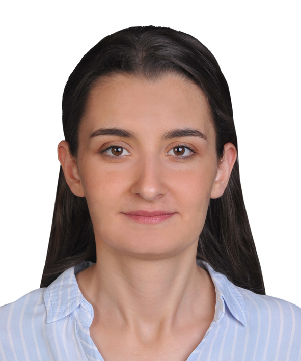

{fig-align="center" fig-width="5%"}

# Education

-   M.S., Industrial Engineering (Thesis), Hacettepe University, Turkey, 2025 - ongoing.
-   M.S., Data and Information Engineering (Non-Thesis), Hacettepe University, Turkey, 2023 - 2025.
-   B.S., Industrial Engineering, Hacettepe University, Turkey, 2017 - 2022.

## Employements

1.  ASELSAN, Planning Engineer, 2022-Ongoing

## Internships

1.  Tosyalı Holding, Intern, 2021

2.  SFA Electric, Intern, 2021

# Projects

1.  Development of Budget Estimation Tool by Using Machine Learning Within KOVAN ERP

# Publications

Not Yet

# Competencies

R, Quarto, Git, Python, Matlab,

# Hobbies

Playing violin, Swimming

## \# CV

[Selin DUZEN CV](assets/SelinDUZEN.pdf)
